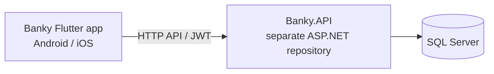

# AbuD Banky Mobile | تطبيق المحفظة الرقمية

**محفظة رقمية عربية للهواتف، مبنية باستخدام Flutter وDart.** تساعد المستخدم على متابعة محافظه متعددة العملات وإجراء التحويلات والمدفوعات ومراجعة المعاملات من واجهة عربية تدعم RTL.

[مستودع ASP.NET API ولوحة الإدارة](https://github.com/AbuD2023/AbuD_Banky-OnlineBankingAndWallet--Razor-Pages-.NET-8-) · [الترخيص](LICENSE) · [المساهمة](CONTRIBUTING.md)

## عن التطبيق

هذا المستودع يحتوي على **تطبيق الهاتف فقط**. يتصل التطبيق بخدمات `Banky.API` التي تُدار في مستودع ASP.NET مستقل؛ لا يتضمن هذا المستودع الخادم أو قاعدة البيانات. يلزم تشغيل نسخة متوافقة من API لاستخدام الوظائف التي تعتمد على الشبكة.



## المزايا

- إنشاء الحساب وتسجيل الدخول واستعادة كلمة المرور وتغييرها.
- عرض الأرصدة والمحافظ متعددة العملات وإنشاء محفظة عند توفر العملة.
- البحث عن المستلم والتحويل عبر رقم الهاتف مع معاينة الرسوم.
- الدفع لنقاط البيع وإدارة نقاط البيع التابعة للمستخدم.
- احتساب الصرف والتحويل بين محافظ المستخدم.
- سجل المعاملات والإيصالات.
- إرسال وثائق الهوية ومتابعة حالة التحقق KYC.
- إعدادات الخصوصية، والمظهر الفاتح والداكن والتلقائي.
- واجهة عربية واتجاه RTL مع إدارة حالة Provider.

## التقنيات

- Flutter وDart
- Provider لإدارة الحالة
- HTTP للاتصال بـ REST API
- SharedPreferences لتخزين بيانات الجلسة محليًا
- Intl لتنسيق القيم والتواريخ
- Image Picker لاختيار وثائق التحقق

## المتطلبات

- Flutter SDK وDart بإصدارين متوافقين مع القيود في `pubspec.yaml`.
- خادم `Banky.API` متوافق وقابل للوصول من الجهاز أو المحاكي.
- Android Studio لبناء Android، أو macOS مع Xcode لبناء iOS.

## التنزيل والتشغيل

استنسخ تطبيق الهاتف:

```bash
git clone https://github.com/AbuD2023/AbuD_Banky-OnlineBankingAndWallet--Flutter_Dart_Mobile_Phone.git
cd AbuD_Banky-OnlineBankingAndWallet--Flutter_Dart_Mobile_Phone
```

استنسخ وشغّل الخادم باتباع [تعليمات مستودع ASP.NET](https://github.com/AbuD2023/AbuD_Banky-OnlineBankingAndWallet--Razor-Pages-.NET-8-#تشغيل-محليًا). بعد تشغيل API، عدّل `baseUrl` في `lib/core/api_constants.dart` لعنوان يمكن لبيئة التشغيل الوصول إليه. أمثلة تطوير شائعة:

| البيئة | مثال عنوان API |
| --- | --- |
| Android Emulator | `http://10.0.2.2:5021` |
| iOS Simulator | `http://localhost:5021` |
| هاتف فعلي | `http://<computer-lan-ip>:5021` |

قد يختلف المنفذ حسب إعدادات التشغيل. تأكد من أن الخادم يسمح بالاتصال من الجهاز وأن عنوانه ليس عنوانًا خاصًا مكشوفًا في مستودع عام.

ثبّت الاعتماديات وشغّل التطبيق:

```bash
flutter pub get
flutter run
```

بناء Android:

```bash
flutter build apk --release
```

بناء iOS على macOS مع Xcode:

```bash
flutter build ios --release
```

## بنية التطبيق

```text
lib/
  core/       الثيم والمصادقة وثوابت API
  models/     نماذج المستخدم والمحافظ والمعاملات ونقاط البيع
  screens/    شاشات الحساب والمحفظة والتحويل والإعدادات
  services/   الاتصال بخادم Banky.API
  widgets/    مكونات واجهة مشتركة
```

## العلاقة بمشروع ASP.NET

التطبيق والخادم مستودعان منفصلان ويمكن تنزيلهما وتطويرهما كلٌّ على حدة، لكن الميزات المتصلة في التطبيق تحتاج API متوافقة.

- [مستودع تطبيق Flutter الحالي](https://github.com/AbuD2023/AbuD_Banky-OnlineBankingAndWallet--Flutter_Dart_Mobile_Phone)
- [مستودع ASP.NET Core API ولوحة الإدارة](https://github.com/AbuD2023/AbuD_Banky-OnlineBankingAndWallet--Razor-Pages-.NET-8-)

عند تغيير مسارات API أو أشكال البيانات، يجب تنسيق التغيير بين المستودعين وتحديث العميل والخادم بما يحافظ على التوافق.

## صور واجهات التطبيق

لا يتضمن المستودع لقطات شاشة فعلية للواجهات حاليًا. التقط الصور من التطبيق بعد تشغيله على محاكي أو جهاز، وأخفِ الأسماء وأرقام الهواتف والأرصدة والرموز وأي بيانات شخصية. أنشئ `docs/screenshots/` وضع الصور فيها بأسماء واضحة مثل `wallet-home.png` و`transfer-review.png`، ثم أضفها إلى README بمسارات نسبية:

```markdown


```

بعد ذلك ارفع الصور وREADME إلى نفس مستودع Flutter؛ ستظهر الصور تلقائيًا على GitHub. اختر صورًا واضحة بالحجم الأصلي للهاتف، ولا ترفع صورًا مولدة أو بيانات مستخدم حقيقية.

## الأمان والترخيص

هذا التطبيق نموذج تعليمي/تطبيقي وليس تطبيقًا مصرفيًا معتمدًا لمعالجة أموال حقيقية. لا تستخدم بيانات حقيقية أو بيئة إنتاج قبل مراجعة أمان العميل والخادم، وضبط HTTPS وحماية الرموز والبيانات الشخصية واختبار تدفقات التحويل وKYC. راجع [LICENSE](LICENSE) و[CONTRIBUTING.md](CONTRIBUTING.md).

---

## English

**AbuD Banky Mobile** is an Arabic-first Flutter wallet client for Android and iOS. It provides multi-currency wallet views, phone-based transfers, POS payments and management, self-exchange, transaction history, KYC submission, privacy settings, and light/dark themes.

This repository contains the mobile app only. It requires a reachable, compatible `Banky.API` backend, maintained separately in the [ASP.NET repository](https://github.com/AbuD2023/AbuD_Banky-OnlineBankingAndWallet--Razor-Pages-.NET-8-). Clone the app, start the API, configure `lib/core/api_constants.dart`, then run `flutter pub get` and `flutter run`.

### GitHub discovery

Suggested repository description: **Arabic-first Flutter mobile wallet for multi-currency balances, phone transfers, POS payments, KYC, and transaction history.**

Suggested topics: `flutter`, `dart`, `digital-wallet`, `mobile-banking`, `fintech`, `arabic`, `rtl`, `android`, `ios`, `point-of-sale`.

To apply these, open this repository on GitHub, select the **About** gear, enter the description, and add the topics above. Put the ASP.NET repository URL in the Website field. For the repository's Social Preview, open **Settings > General > Social preview** and upload a branded image (1280 x 640 px recommended). Add actual app screenshots under `docs/screenshots/` and embed them using the relative paths shown in the Arabic section above. Keep topics relevant to this Flutter client.

### Safety notice

This is an educational/sample client, not a production banking app. Do not use it with real funds or personal data without a full security and privacy review of both the app and its backend.
